# 🏢 MADAR — Enterprise Hybrid Identity & Workforce Access

## Phase 04 of the MADAR Cloud Transformation

> **✅ STATUS: COMPLETED • VALIDATED • FAILURE-TESTED • CLEANED UP**  
> Corporate Active Directory → encrypted hybrid routing → AWS Directory Service AD Connector → Amazon WorkSpaces → domain-user authentication → controlled failure/recovery → resource and cost closeout.

<p align="center">
  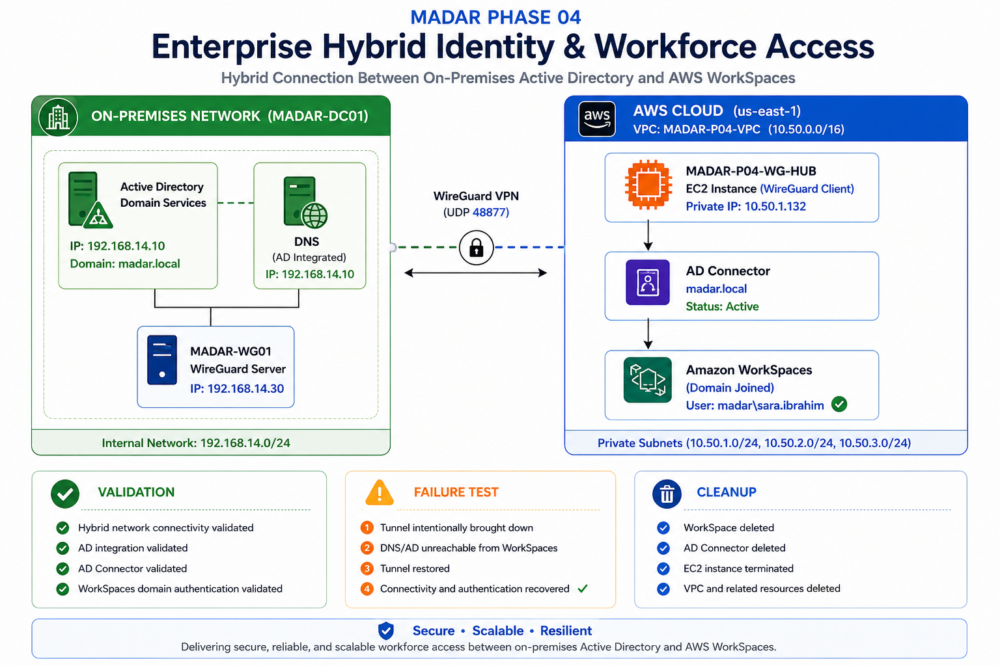
</p>

<p align="center"><strong>Validated implementation architecture — not a hypothetical target design.</strong></p>

MADAR already migrated its representative legacy workload in Phase 03. Phase 04 addresses the next enterprise problem: **how cloud-hosted workforce environments can consume an existing corporate identity source without creating a second disconnected user directory.**

The result is a reproducible hybrid-identity lab with positive tests, negative tests, failure injection, recovery validation, operational runbooks, architecture decisions, evidence and controlled cleanup.

---

## 🎯 What this project proves

A synthetic MADAR employee defined in the on-premises Active Directory authenticated successfully to an AWS-managed Windows desktop while the authoritative directory remained on-premises.

```text
👩 Sara Ibrahim
   sara.ibrahim@madar.local
          │
          │ corporate AD credentials
          ▼
☁️ Amazon WorkSpaces Personal
   domain-joined AWS-managed desktop
          │
          ▼
🔌 AWS Directory Service — AD Connector
          │
          ▼
🔐 Routed WireGuard hybrid network
          │
          ▼
🏢 MADAR-DC01
   192.168.14.10
   AD DS + DNS
   madar.local
```

The WorkSpace was not treated as merely another Windows VM. It was the final AWS-managed consumer used to prove the complete hybrid identity chain.

---

## 🏆 Final result

| Engineering gate | Result |
|---|---|
| Active Directory / DNS | ✅ Complete |
| Workforce users and security groups | ✅ Complete |
| Domain client / GPO | ✅ Complete |
| Local least privilege | ✅ Verified |
| CGNAT-aware hybrid design | ✅ Complete |
| AWS VPC/private routing | ✅ Validated |
| WireGuard tunnel | ✅ Validated |
| AWS → on-prem AD/DNS path | ✅ Validated |
| AD Connector | ✅ Reached Active |
| WorkSpaces directory registration | ✅ Validated |
| Dedicated WorkSpaces OU | ✅ Validated |
| WorkSpace domain join | ✅ Verified |
| Corporate domain-user cloud login | ✅ Verified |
| WorkSpace → on-prem DNS/DC path | ✅ Verified |
| VPN failure injection | ✅ Verified |
| VPN recovery | ✅ Verified |
| Documentation / evidence | ✅ Complete |
| Temporary AWS resource cleanup | ✅ Complete |
| Cost closeout | ✅ Reviewed |

---

## 🌐 Implemented architecture

The hero diagram above is the visual map of the validated implementation. The packet path is summarized below for command-line readability:

```text
HOME / VMware                                      AWS / us-east-1

MADAR-DC01                                         MADAR-P04-VPC
192.168.14.10                                      10.50.0.0/16
AD DS + DNS                                             |
      |                                                |
      v                                                v
MADAR-WG01   ===== encrypted WireGuard =====      MADAR-P04-WG-HUB
192.168.14.30      10.200.0.2 <-> 10.200.0.1      EC2 routing appliance
                                                       |
                                                       +--> AD Connector
                                                       |
                                                       +--> Amazon WorkSpaces
                                                            user: sara.ibrahim
```

The home lab sits behind carrier-grade NAT. A design requiring an inbound-reachable static home endpoint was therefore unsuitable. `MADAR-WG01` initiated the WireGuard tunnel outbound toward the AWS-side EC2 routing appliance.

> The VPN in this project is **self-managed WireGuard on EC2**, not AWS managed Site-to-Site VPN.

---

## 🧠 Why Client01 and WorkSpaces both exist

```text
MADAR-CLIENT01
  = local corporate endpoint
  = proves AD join, domain login, GPO and local authorization

Amazon WorkSpaces
  = AWS-managed cloud desktop
  = proves AWS can consume the on-prem corporate directory end to end
```

Think of Client01 as testing the identity system **inside headquarters** before asking a remote AWS-managed office to use the same employee directory. This isolates problems: first prove the directory, then prove the hybrid integration.

---

## 🔌 AD Connector troubleshooting story

The Connector initially exposed two different failure layers:

```text
Attempt 1
DNS unavailable / TCP 53
        ↓
network troubleshooting
        ↓
Attempt 2
Invalid credentials
        ↓
service-account validation/reset
        ↓
Fresh Connector
Stage = Active ✅
```

This evolution matters. It demonstrates layer-by-layer troubleshooting rather than repeatedly rebuilding resources until one happens to work.

---

## 🖥️ Amazon WorkSpaces proof

A dedicated OU was used for AWS-created computer objects:

```text
OU=WorkSpaces,OU=MADAR,DC=madar,DC=local
```

The `svc-adconnector` service account was delegated the computer-object permissions required for WorkSpaces domain join. No password or reusable secret is stored in this repository.

Historical test WorkSpace:

```text
WorkSpace ID : ws-49q8s94dl
User         : sara.ibrahim
Computer     : WSAMZN-I0F8R2FL
Private IP   : 10.50.13.89
Mode         : AutoStop after 1 hour
```

### Domain join proof

On `MADAR-DC01`:

```powershell
Get-ADComputer -Filter * `
  -SearchBase "OU=WorkSpaces,OU=MADAR,DC=madar,DC=local" `
  -Properties DNSHostName,Enabled |
Select-Object Name,DNSHostName,Enabled,DistinguishedName
```

Observed before cleanup:

```text
Name        : WSAMZN-I0F8R2FL
DNSHostName : WSAMZN-I0F8R2FL.madar.local
Enabled     : True
```

### End-user authentication proof

Inside the WorkSpace:

```powershell
whoami
hostname
$env:USERDNSDOMAIN
```

Observed:

```text
madar\sara.ibrahim
WSAMZN-I0F8R2FL
MADAR.LOCAL
```

That closes the identity path:

```text
On-prem AD user
      ↓
AD Connector
      ↓
Amazon WorkSpaces
      ↓
Domain-joined AWS-managed desktop
      ↓
Successful corporate-user authentication ✅
```

---

## 💥 Failure and recovery test

A successful login was not considered sufficient. The hybrid dependency was intentionally broken.

Healthy baseline from the WorkSpace:

```powershell
Test-NetConnection 192.168.14.10 -Port 53
Resolve-DnsName madar.local -Server 192.168.14.10
```

Healthy result:

```text
SourceAddress    : 10.50.13.89
TcpTestSucceeded : True
madar.local      : 192.168.14.10
```

Failure injection on `MADAR-WG01`:

```bash
sudo wg-quick down wg0
```

Observed from the WorkSpace:

```text
TcpTestSucceeded : False
Resolve-DnsName  : timeout
```

Recovery:

```bash
sudo wg-quick up wg0
sudo wg show
```

The same WorkSpace tests returned to success.

```text
Healthy ✅
   ↓
WireGuard intentionally stopped 💥
   ↓
WorkSpace-to-AD connectivity lost ❌
   ↓
WireGuard restored 🔧
   ↓
TCP/DNS connectivity recovered ✅
```

---

## 🧹 Resource cleanup

The temporary cloud environment was removed after evidence capture.

```text
Amazon WorkSpace          ✅ Deleted
WorkSpaces registration   ✅ Removed
AD Connector              ✅ Deleted
WG-HUB EC2                ✅ Terminated
Elastic IP                ✅ Released
WG-HUB Security Group     ✅ Deleted
Hybrid route              ✅ Deleted
Phase 04 subnets          ✅ Deleted
Custom route tables       ✅ Deleted
Internet Gateway          ✅ Deleted
Phase 04 VPC              ✅ Deleted
```

The final AWS audit returned no WorkSpaces, no Directory Service directory, no Elastic IP and no Phase 04 VPC. The terminated EC2 record may remain visible temporarily in EC2 history, which is expected.

---

## 💰 Cost closeout

The final Cost Explorer checkpoint showed:

```text
Gross month-to-date Usage/Fee : $ 2.1355 USD
AWS credits applied           : $-2.1355 USD
Calculated net                : $ 0.0000 USD
```

These are **account-level month-to-date values**, not a claim that all service usage shown by Cost Explorer belonged only to Phase 04. Resource-specific cleanup was validated separately through AWS inventory commands.

---

## 📸 Evidence highlights

### Final closeout — cleanup + cost review

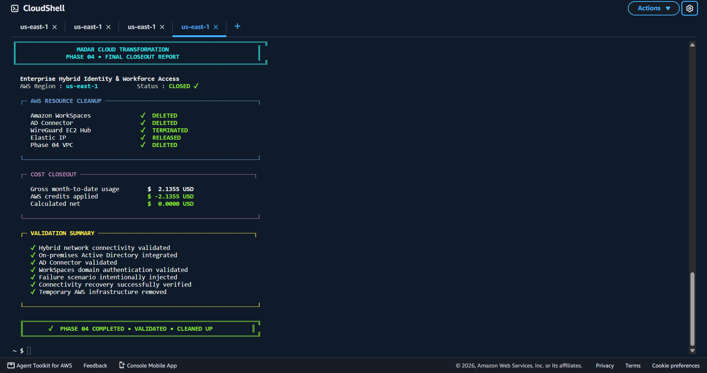

### AD Connector reached Active

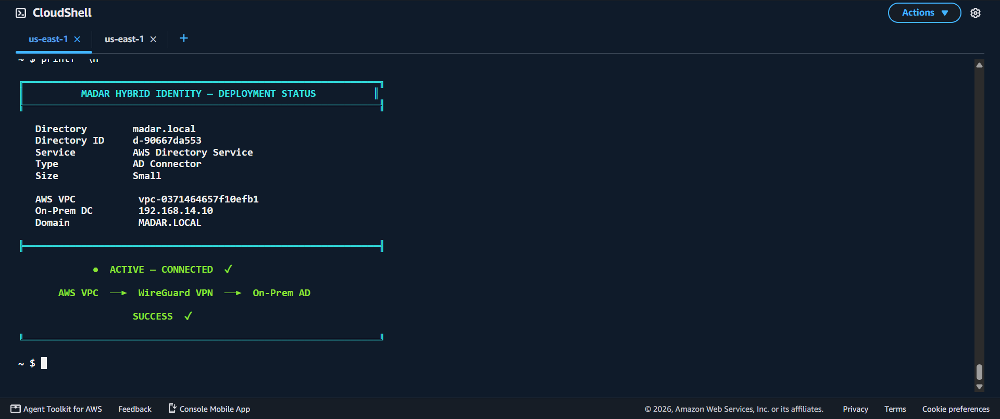

### WireGuard tunnel

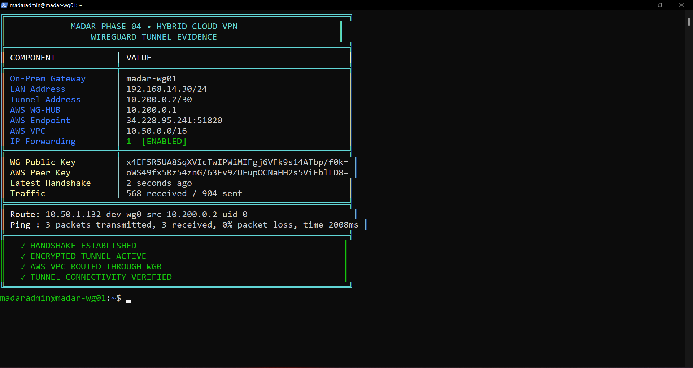

### AWS → on-premises AD connectivity

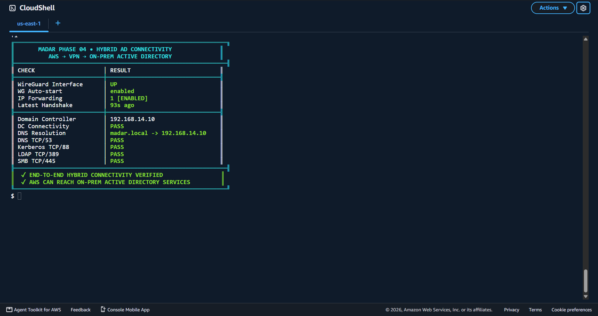

### WorkSpace computer object created in on-prem AD

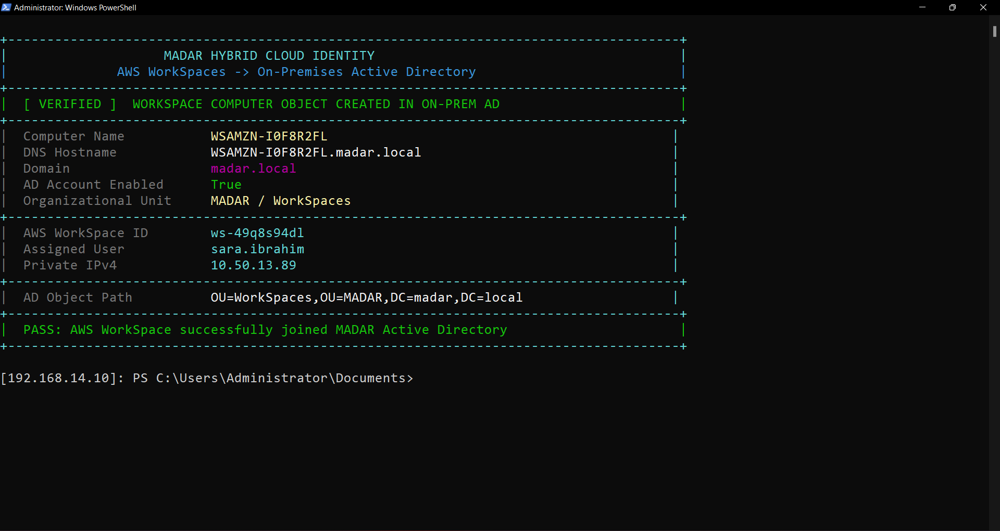

### Corporate user authenticated to AWS WorkSpaces

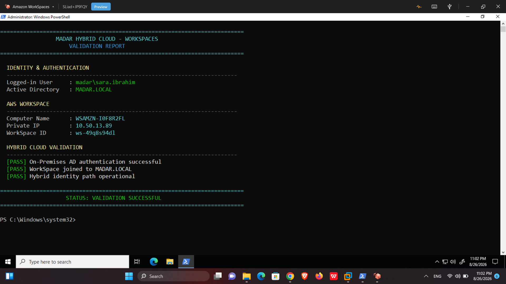

### Healthy baseline → failure → recovery

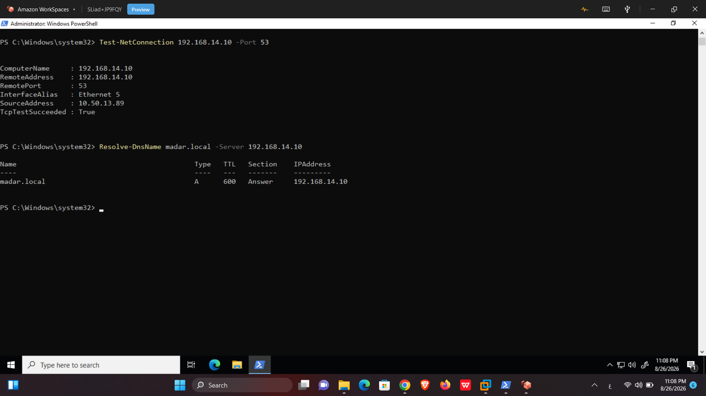

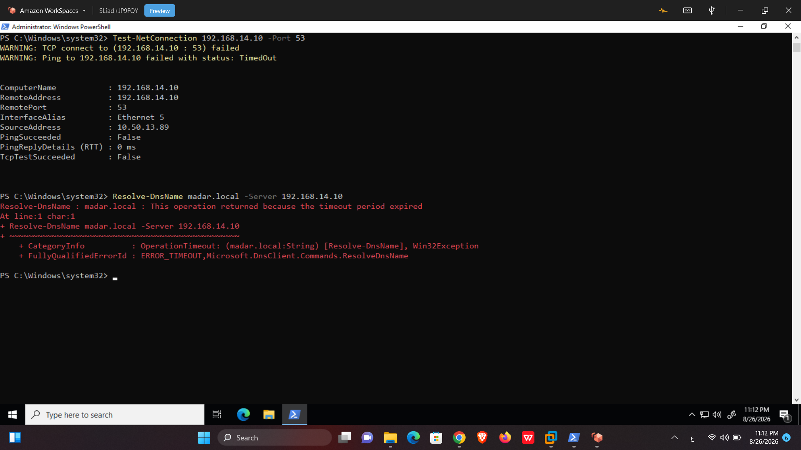

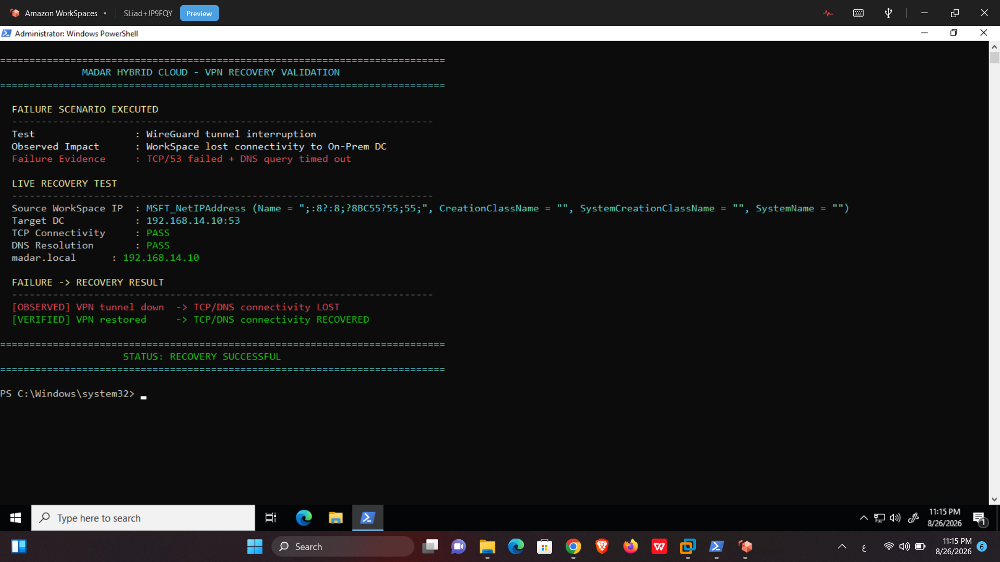

### Local least-privilege proof

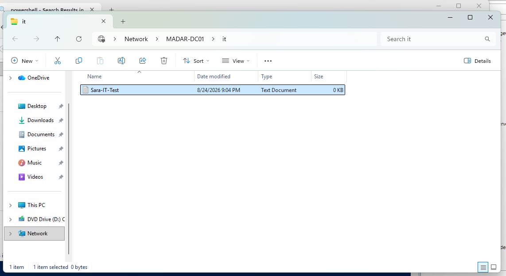

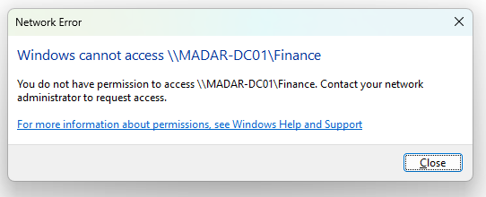

See [`evidence/README.md`](evidence/README.md) for the complete evidence map.

---

## 🛠️ Rebuild and command references

This repository is intentionally documented so the lab can be rebuilt without relying on conversation history.

| Resource | Purpose |
|---|---|
| [`runbooks/00-lab-rebuild-and-validation.md`](runbooks/00-lab-rebuild-and-validation.md) | full rebuild, validation, troubleshooting, failure drill and cleanup handbook |
| [`runbooks/01-command-check-reference.md`](runbooks/01-command-check-reference.md) | fast command/check reference |
| [`CURRENT-STATE.md`](CURRENT-STATE.md) | final implemented state and closeout |
| [`decisions/`](decisions/) | architecture decision records |
| [`evidence/README.md`](evidence/README.md) | evidence-to-claim mapping |

---

## ⚖️ Why IAM Identity Center was not forced

The original architecture included:

```text
AD → AD Connector → IAM Identity Center → SSO/MFA → Permission Sets
```

That branch was not executed in this lab because the agreed account/cost guardrail was to remain within the AWS Free Plan and not introduce Organizations/account-plan changes merely to satisfy the initial diagram.

The implemented and validated outcome became:

```text
Corporate AD
      ↓
Hybrid network
      ↓
AD Connector
      ↓
Amazon WorkSpaces
      ↓
Corporate domain-user authentication
```

Direct AWS-account workforce SSO through IAM Identity Center remains a future production extension when the required organizational prerequisites are intentionally available. The repository does not claim that capability was implemented.

---

## 📂 Repository structure

```text
.
├── README.md
├── CURRENT-STATE.md
├── REPOSITORY-SCOPE.md
├── checklists/
├── decisions/
├── docs/
├── evidence/
├── identity-model/
├── runbooks/
└── tests/
```

---

## 🚀 MADAR journey

```text
Phase 01  Cloud Foundation                     COMPLETE
Phase 02  Serverless Event Processing          COMPLETE
Phase 03  Legacy Migration & Data Center Exit  COMPLETE
Phase 04  Enterprise Hybrid Identity           COMPLETE ✅
          ├── Local AD / client                 COMPLETE
          ├── WireGuard hybrid network          COMPLETE
          ├── AD Connector                      VALIDATED
          ├── WorkSpaces domain join            VERIFIED
          ├── Domain-user cloud authentication  VERIFIED
          ├── Failure / recovery                VERIFIED
          └── Cleanup / cost closeout            COMPLETE
Phase 05  Application Modernization            NEXT
```

Master transformation record: `EngMohammedBashir/MADAR-cloud-transformation`.
