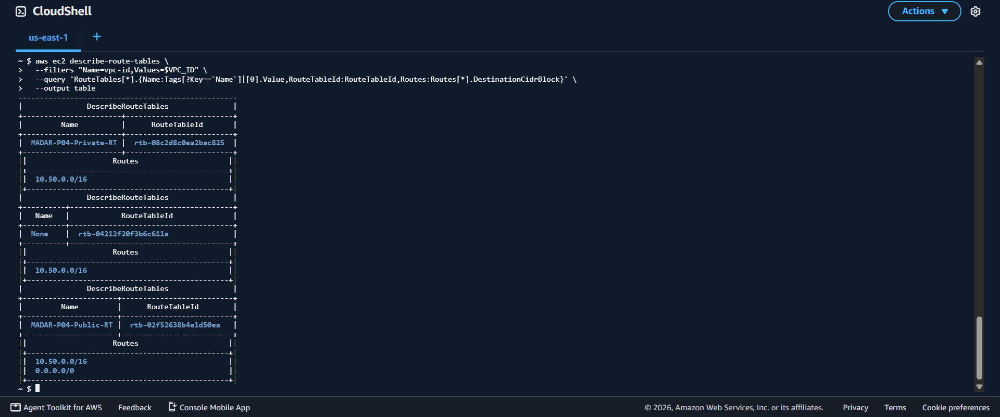

# MADAR — Enterprise Identity & Workforce Access

## Phase 04 of the MADAR Cloud Transformation

> **Status: ACTIVE — HYBRID NETWORK VALIDATED / AD CONNECTOR AUTHENTICATION NEXT**  
> Corporate Active Directory → routed WireGuard hybrid connectivity → AWS Directory integration → IAM Identity Center → SSO/MFA → permission sets → lifecycle/audit validation.

MADAR has already migrated its representative legacy workload in Phase 03. Phase 04 solves the next enterprise problem: **how employees securely access AWS through centralized workforce identity instead of individual long-lived IAM credentials.**

---

## What is working now

The project has moved beyond a local Active Directory demo. A routed hybrid path now connects the VMware corporate network to an AWS VPC through a self-managed WireGuard network appliance.

```text
HOME / VMware                                      AWS / us-east-1

MADAR-DC01                                         MADAR-P04-VPC
192.168.14.10                                      10.50.0.0/16
AD DS + DNS                                             |
      |                                                |
      v                                                v
MADAR-WG01   ===== encrypted WireGuard =====      MADAR-P04-WG-HUB
192.168.14.30      10.200.0.2 <-> 10.200.0.1      EC2 network appliance
                                                       |
                                                       v
                                                Private subnets
                                                       |
                                                       v
                                                  AD Connector
                                                       |
                                                       v
                                             IAM Identity Center
                                                       |
                                                       v
                                        Groups + Permission Sets
                                                       |
                                                       v
                                           SSO + MFA + CLI
```

### Current milestone

| Layer | Status | Proof |
|---|---|---|
| Active Directory / DNS | ✅ Complete | `madar.local` on `MADAR-DC01` |
| Workforce users/groups | ✅ Complete | departmental users + Global Security Groups |
| Domain client + GPO | ✅ Complete | join, login and firewall/GPO validation |
| Local least privilege | ✅ Complete | allowed IT share + denied Finance share |
| CGNAT-aware hybrid design | ✅ Complete | outbound-initiated WireGuard architecture |
| AWS VPC/private subnets | ✅ Complete | dedicated `10.50.0.0/16` network |
| WireGuard handshake | ✅ Complete | bidirectional tunnel counters + tunnel ping |
| AWS → on-prem routing | ✅ Complete | route to `192.168.14.0/24` through WG-HUB |
| AWS → AD/DNS traffic | ✅ Complete | DNS TCP/53 request/reply observed |
| AD Connector authentication | 🟡 Next fix | latest failure is invalid credentials, not networking |
| IAM Identity Center / SSO | ⏳ Pending | begins after Connector becomes Active |

---

## Why this architecture exists

The home lab uses Zain 5G and sits behind carrier-grade NAT (CGNAT). The router does not own a stable public IPv4 suitable for a classic static-address Customer Gateway design.

Instead of pretending that constraint does not exist, the lab uses a **self-managed routed WireGuard VPN**:

```text
CGNAT problem
     ↓
Inbound home endpoint is unreliable
     ↓
MADAR-WG01 initiates outbound
     ↓
AWS EC2 provides the stable tunnel endpoint
     ↓
Private routed access to madar.local
```

This design keeps the domain controller private and creates a real routed path for centralized identity integration.

> This is intentionally documented as **self-managed WireGuard on an EC2 network appliance**, not AWS managed Site-to-Site VPN.

Architecture decision: [`decisions/ADR-004-cgnat-wireguard-hybrid-connectivity.md`](decisions/ADR-004-cgnat-wireguard-hybrid-connectivity.md)  
Execution plan: [`docs/12-wireguard-hybrid-execution-plan.md`](docs/12-wireguard-hybrid-execution-plan.md)  
Current checkpoint: [`CURRENT-STATE.md`](CURRENT-STATE.md)

---

## The troubleshooting story

The strongest part of this phase is not that everything worked on the first attempt. It did not.

### Incident 1 — AD Connector reported DNS unavailable

The first Directory Service attempts failed with:

```text
Connectivity issues detected:
DNS unavailable (TCP port 53) for IP 192.168.14.10
```

Rather than repeatedly recreating the connector, the path was tested layer by layer:

```text
AD Connector ENIs
      ↓
Private subnet association
      ↓
Route table
      ↓
WG-HUB Security Group
      ↓
EC2 network appliance
      ↓
Linux forwarding / NAT
      ↓
WireGuard
      ↓
MADAR-WG01
      ↓
MADAR-DC01:53
```

`tcpdump` was used on the EC2 appliance interfaces to determine whether packets reached the router and whether they entered the tunnel.

The key defect was an AWS-side security boundary: the `WG-HUB` Security Group admitted WireGuard UDP/51820 but did not admit the required VPC transit traffic from `10.50.0.0/16`.

After correcting the VPC-side path, AWS-originated DNS traffic reached `192.168.14.10` and the domain controller replied. A complete TCP handshake was observed.

### Incident 2 — failure moved to credentials

The next AD Connector attempt no longer failed on DNS. It progressed to:

```text
Configuration issues detected:
Invalid credentials (bad username/password)
```

That is a useful engineering checkpoint: **the network layer is now proven and the remaining blocker is authentication.**

The next session will validate/reset the dedicated `svc-adconnector` account and retry the connector without redesigning the working network.

---

## Hybrid networking details

| Purpose | Network / address |
|---|---|
| Local corporate LAN | `192.168.14.0/24` |
| Domain Controller / DNS | `192.168.14.10` |
| Local WireGuard router | `192.168.14.30` |
| WireGuard transit | `10.200.0.0/30` |
| AWS tunnel peer | `10.200.0.1` |
| Local tunnel peer | `10.200.0.2` |
| AWS VPC | `10.50.0.0/16` |
| WireGuard | UDP `51820` |

The private-subnet route table contains a route for `192.168.14.0/24` through the EC2 routing appliance.

The EC2 instance is deliberately treated as a **network appliance**. That means the design must account for source/destination checks, Linux IPv4 forwarding, Security Groups, WireGuard AllowedIPs, route tables and forwarding/NAT behavior—not merely whether the instance itself can ping the tunnel peer.

---

## Local workforce model

| Department | Synthetic employee | AD security group |
|---|---|---|
| Management | Ahmed Ali (`ahmed.ali`) | `GG-Management` |
| IT | Sara Ibrahim (`sara.ibrahim`) | `GG-IT` |
| Finance | Omar Hassan (`omar.hassan`) | `GG-Finance` |
| HR | Noura Saleh (`noura.saleh`) | `GG-HR` |
| Sales | Khalid Mansour (`khalid.mansour`) | `GG-Sales` |

These identities are synthetic and exist only for the lab.

Local authorization has already been proven: the IT identity can access the intended IT share and is denied access to the Finance share.

---

## Evidence highlights

### WireGuard tunnel


### AWS-to-on-premises AD connectivity


### AWS routing



### Domain controller


### Workforce group membership


### Domain join


### Local least-privilege proof

Allowed IT access:


Denied Finance access:


See [`evidence/README.md`](evidence/README.md) for the evidence map and what each screenshot proves.

---

## Phase objective

Phase 04 closes only after the project demonstrates:

- centralized workforce identity,
- group-based AWS authorization,
- IAM Identity Center,
- SSO and MFA,
- temporary AWS credentials,
- permission sets and least privilege,
- positive and negative AWS access tests,
- console and CLI SSO,
- onboarding / role-change / offboarding workflows,
- CloudTrail audit evidence,
- cost-aware cleanup.

## Execution path

```text
Local AD/client validation                       COMPLETE
      ↓
CGNAT/public-IP preflight                        COMPLETE
      ↓
WireGuard architecture decision                  COMPLETE
      ↓
MADAR-WG01 + AWS WG-HUB                          COMPLETE
      ↓
WireGuard handshake                              COMPLETE
      ↓
AWS → on-prem routed DNS/AD path                 COMPLETE
      ↓
AD Connector credential validation               NEXT
      ↓
AD Connector Active
      ↓
AWS Organizations / IAM Identity Center
      ↓
Permission Sets + account assignments
      ↓
SSO + MFA + temporary sessions
      ↓
AWS CLI SSO
      ↓
Positive + negative authorization tests
      ↓
Joiner / mover / leaver
      ↓
CloudTrail audit
      ↓
Evidence + cost/resource cleanup
      ↓
PHASE 04 ACCEPTED
```

Detailed checklist: [`checklists/phase04-master-checklist.md`](checklists/phase04-master-checklist.md)

---

## Cost discipline

This is a portfolio lab, not a permanently running environment.

At the latest pause point:

- the failed AD Connector was deleted,
- the EC2 `WG-HUB` was stopped,
- local VMware VMs can be powered off,
- persistent storage/public-address costs remain part of the cleanup review.

Paid resources are kept alive only long enough to validate a gate and capture evidence.

---

## Repository structure

```text
.
├── README.md
├── CURRENT-STATE.md
├── REPOSITORY-SCOPE.md
├── checklists/
├── decisions/
├── docs/
├── evidence/
├── identity-model/
├── policies/
├── runbooks/
└── tests/
```

## MADAR journey

```text
Phase 01  Cloud Foundation                     COMPLETE
Phase 02  Serverless Event Processing          COMPLETE
Phase 03  Legacy Migration & Data Center Exit  COMPLETE
Phase 04  Enterprise Identity & Workforce      ACTIVE
          ├── Local AD/client                   COMPLETE
          ├── Hybrid design                     COMPLETE
          ├── WireGuard tunnel                  COMPLETE
          ├── AWS → AD network path             COMPLETE
          └── AD Connector authentication       NEXT
Phase 05  Application Modernization            FUTURE
```

Master transformation record: `EngMohammedBashir/MADAR-cloud-transformation`.