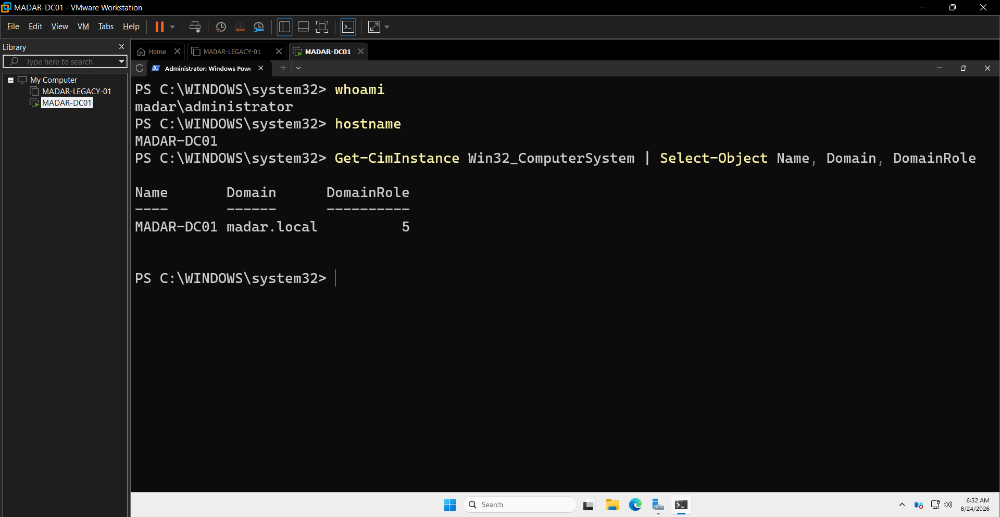
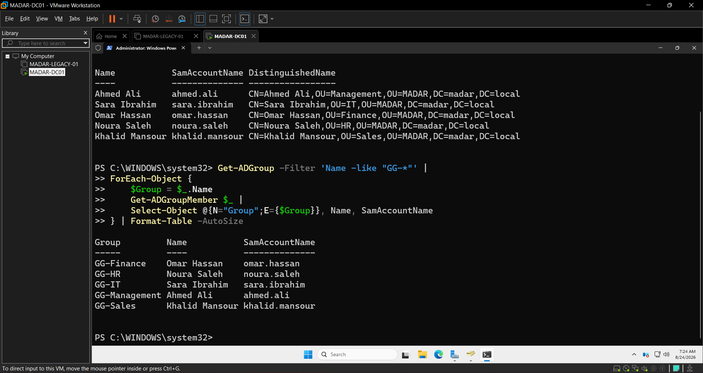
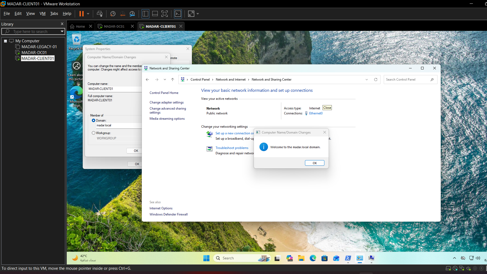
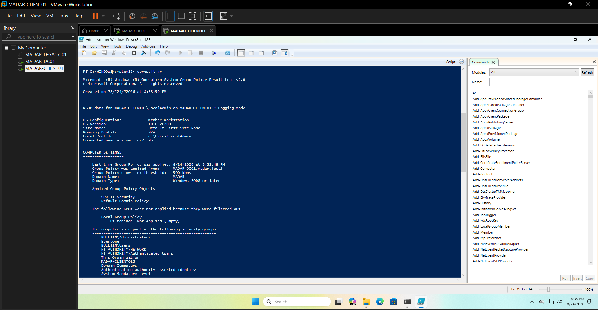

# MADAR — Enterprise Identity & Workforce Access

## Phase 04 of the MADAR Cloud Transformation

> **Status: ACTIVE — LOCAL IDENTITY LAB VALIDATED / AWS INTEGRATION NEXT**  
> Corporate Active Directory representation → domain client validation → group/GPO authorization proof → AWS identity integration → IAM Identity Center → SSO/MFA → permission sets → lifecycle/audit validation → cleanup.

MADAR has completed the representative workload migration in Phase 03. Phase 04 addresses the next business problem: **how employees securely access the growing AWS environment through centralized workforce identity instead of individual long-lived IAM credentials.**

## Current execution state

The local corporate-identity foundation is now built and validated.

```text
VMware lab
│
├── MADAR-DC01
│   ├── Windows Server 2025
│   ├── Active Directory Domain Services
│   ├── DNS
│   ├── Domain: madar.local
│   ├── Department OUs
│   ├── Security groups
│   └── Group Policy
│
├── MADAR-CLIENT01
│   ├── Windows 11 Pro
│   ├── joined to madar.local
│   ├── domain-user authentication validated
│   └── GPO enforcement validated
│
└── MADAR-LEGACY-01
    └── retained representative legacy workload
```

Validated locally:

- `MADAR-DC01` promoted to a domain controller for `madar.local`,
- five synthetic department identities created,
- group membership verified with PowerShell,
- `MADAR-CLIENT01` successfully joined to the domain,
- domain login validated with `sara.ibrahim`,
- `GPO-IT-Security` applied to the client,
- Domain firewall policy validated,
- `GG-IT` access to the IT share succeeded,
- cross-department access to the Finance share was denied as designed.

The next execution gate is the **AWS identity-integration architecture and cost check**. No paid Directory Service resource is created until the currently supported path and `us-east-1` cost are confirmed.

## Business story

MADAR's company narrative assumes a corporate employee directory existed before Phase 04. The VMware-hosted Windows Server environment is a **reproducible lab representation** of that existing identity system; it is not a second workload migration and does not rewrite the Phase 03 chronology.

```text
Corporate workforce
      ↓
MADAR Active Directory
      ↓
Supported AWS identity integration
      ↓
AWS IAM Identity Center
      ↓
Groups + Permission Sets
      ↓
SSO + MFA
      ↓
Temporary Console / CLI sessions
```

## Local workforce model

| Department | Synthetic employee | AD security group |
|---|---|---|
| Management | Ahmed Ali (`ahmed.ali`) | `GG-Management` |
| IT | Sara Ibrahim (`sara.ibrahim`) | `GG-IT` |
| Finance | Omar Hassan (`omar.hassan`) | `GG-Finance` |
| HR | Noura Saleh (`noura.saleh`) | `GG-HR` |
| Sales | Khalid Mansour (`khalid.mansour`) | `GG-Sales` |

These identities are synthetic and exist only for the lab.

## Phase objective

Phase 04 closes only after the local identity source is integrated with AWS and the project demonstrates:

- centralized workforce identity,
- group-based authorization,
- IAM Identity Center,
- SSO and MFA,
- temporary AWS credentials,
- permission sets and least privilege,
- positive and negative AWS access tests,
- console and CLI SSO,
- onboarding, role-change and offboarding workflows,
- audit evidence,
- cost-aware cleanup.

## Evidence highlights

### Domain controller verification



### Workforce security-group verification



### Domain join



### GPO applied



### Least-privilege local access test

Allowed IT share access:


Denied Finance share access:


See [`evidence/README.md`](evidence/README.md) for the complete evidence index.

## Execution style

The implementation intentionally uses a hybrid learning approach:

```text
New concept         → GUI / Console first
Understand resource → PowerShell / CLI inspection
Repeated operation  → automation where useful
Validation          → command output + visual evidence
Security boundary   → explicit negative tests
```

The local lab already demonstrates this pattern: the first user was created manually, the remaining workforce identities were automated with PowerShell, and group/GPO behavior was independently verified.

## Cost guardrail

The VMware-hosted identity lab does not consume AWS resources. IAM, STS, AWS Organizations and IAM Identity Center do not add a standalone service charge for the core workforce-access design; the paid-risk point is the selected AWS Directory Service/integration path.

Any paid AWS integration resource used only for validation will be created late, tested quickly, evidenced, and removed after acceptance unless later MADAR phases genuinely require it.

## Repository structure

```text
.
├── README.md
├── CURRENT-STATE.md
├── REPOSITORY-SCOPE.md
├── checklists/
├── decisions/
├── docs/
├── evidence/
├── identity-model/
├── policies/
├── runbooks/
└── tests/
```

## Relationship to the MADAR journey

```text
Phase 01  Cloud Foundation                     COMPLETE
Phase 02  Serverless Event Processing          COMPLETE
Phase 03  Legacy Migration & Data Center Exit  COMPLETE
Phase 04  Enterprise Identity & Workforce      ACTIVE
          ├── Local AD/client validation        COMPLETE
          └── AWS workforce integration         NEXT
Phase 05  Application Modernization            FUTURE
```

Master transformation record: [`EngMohammedBashir/MADAR-cloud-transformation`](https://github.com/EngMohammedBashir/MADAR-cloud-transformation)
